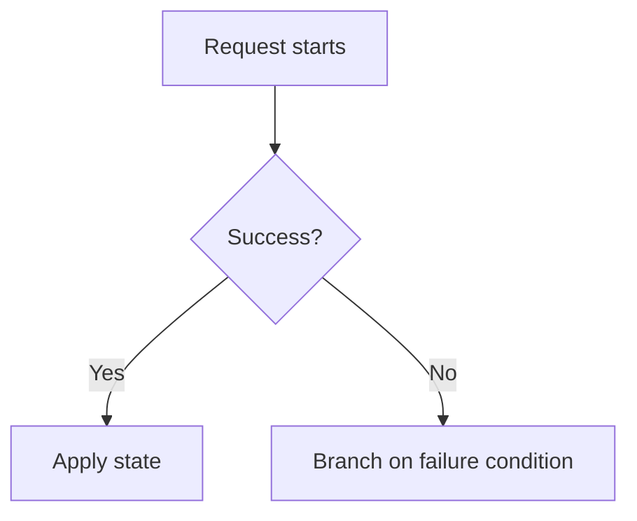

## Why Define Failure Conditions First

(To be written) Defining failure conditions before implementation on the
frontend makes the scope of the work and the exception-handling strategy
much clearer.

## Criteria for Classifying Failures

### Network failures

(To be written)

### State inconsistency

(To be written)

## Code Example

```ts
function assertNever(x: never): never {
  throw new Error(`unexpected value: ${x}`);
}
```

## Diagram



## Conclusion

(To be written)
