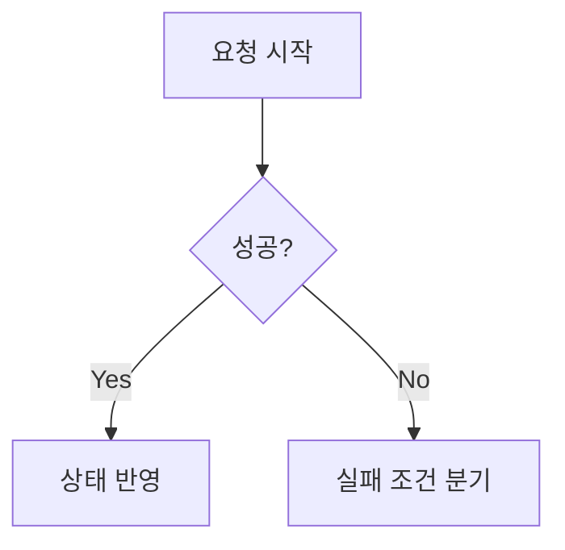

## 왜 실패 조건부터 정의하는가

(작성 예정) 프론트엔드에서 실패 조건을 먼저 정의하면 구현 범위와 예외 처리
전략이 명확해집니다.

## 실패를 분류하는 기준

### 네트워크 실패

(작성 예정)

### 상태 불일치

(작성 예정)

## 코드 예시

```ts
function assertNever(x: never): never {
  throw new Error(`unexpected value: ${x}`);
}
```

## 다이어그램



## 결론

(작성 예정)
